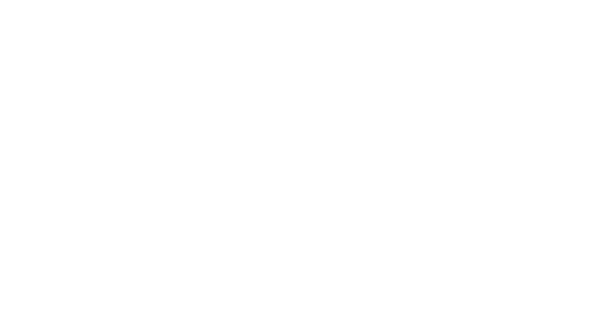

  

  

---

<strong>Full-Stack Developer</strong>

**Origin Story:**
- Supposed to be in Marine Biology, but here we are

**Core Focus:**
- Full-Stack Web Development

**Currently Exploring:**
- AI & Machine Learning
- Hotel Management System (ongoing project)

**Also dabbles in:**
- Mobile Development
- Software Development
- Game Development

🍵 Powered by matcha

---

### 💻 Tech Stack

  

---

### Reach Me

  <a href="mailto:sobremontekate25@gmail.com">📧 sobremontekate25@gmail.com</a> &nbsp;|&nbsp; 🌱 Portfolio coming soon

